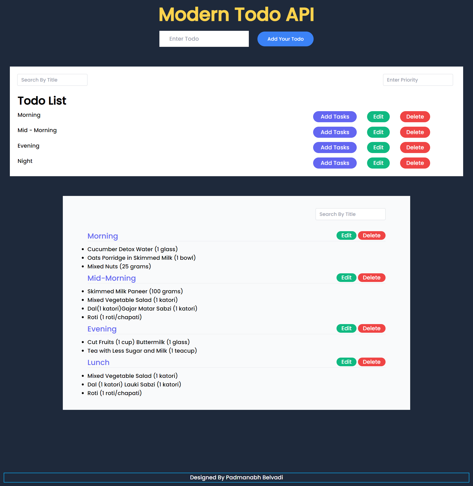
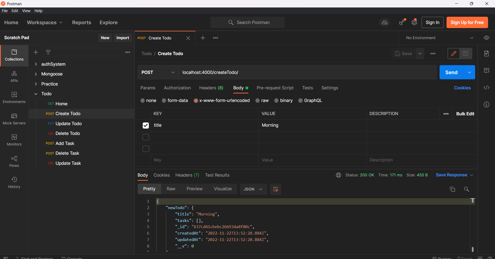
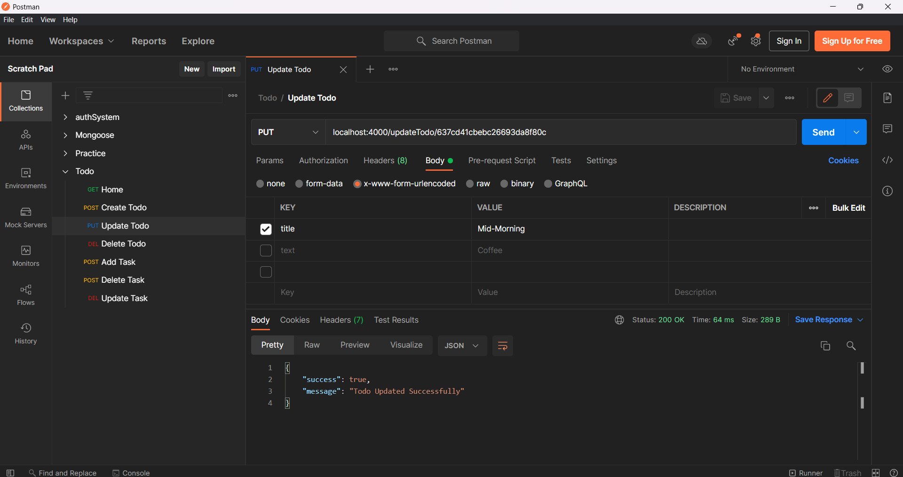
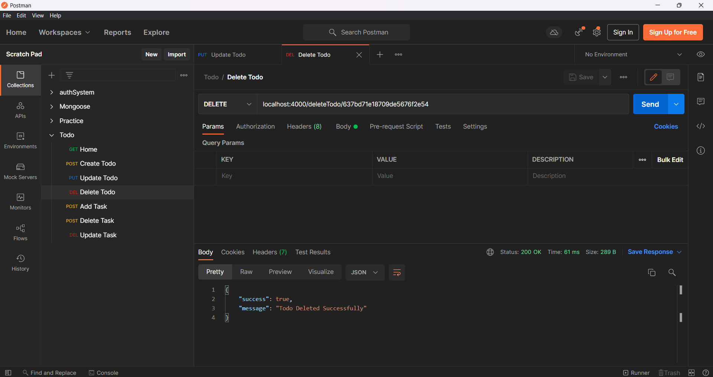
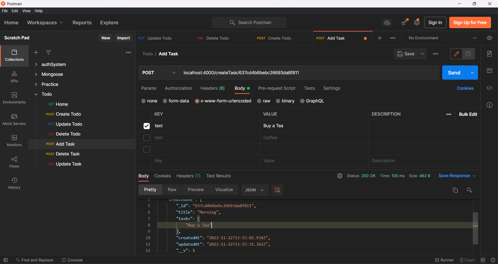
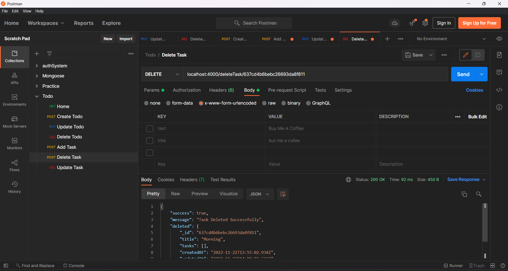

# Modern TODO API
 
This is a Advanced Todo Application that has the fetures of Adding Todos and Adding Tasks For Specific Todos


The Job of this Application is 
- User can add the todo
- User can add specific the task
- User can edit the todo
- User can delete the todo

And Also,
- A Task can be editable
- A Task can be deleted one by one

---

## Visual Design of This Todo 
---


---
## How To Run

Clone The Project
```
git clone https://github.com/Padmanabh-B/Modern-Todo.git
```

Install Node and Run Nodejs by Command

```
npm install
```

To Run The Application

```
npm run dev
```
***
- Note:
The Entire Application Runs on MongoDB Atlas Database So you have to add the URL in the `.env` file, so  it can store the data in your DataBase.
***
## I Tested This Application Using Postman 
### Here are the ScreenShots


```
Create Todo
```


```
Update Todo
```


```
Delete Todo
```


```
Add Task Of Specific Todo By Id
```


```
Delete Task Of Specific Todo By Id 
```



## Reach Me Out on

 [Linkedin](https://www.linkedin.com/in/padmanabh-belavadi)


 [GitHub](https://github.com/padmanabh-b)


 [Instagram](https://www.instagram.com/legend_padmanabh/)

 [Findcoder](https://www.findcoder.io/u/padmanabh_b)